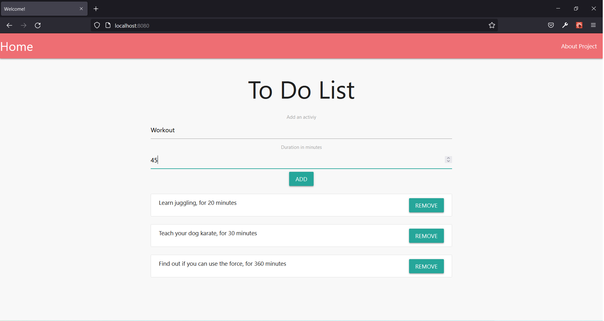

# Symfony React Nginx Node Docker Setup

## Project Description
Parts of the project runs in different containers and is connected via docker network. 
Project setup is handled in docker with the docker compose file. 

The skeleton of the project along with the configs is valid, so in the future other projects can be 
swiftly implemented with couple of tweaks 

The to do list is very basic app but contains all the functionality that is necessary to utilize 
react with symfony mysql docker and nginx. Using MySQL database to keep track of the activities
Added and removed by the user. 

Security mesures such as protection against sql injection attacks and xxs attacks are not 
implemented in this project. Consider Implementing in an actual application

### Tecnologies Used:
*   Docker
*   Nginx
*   Mysql
*   Symfony
*   React.js
*   Node.js
*   Materialize

### Project Motivation
I need more practice using tools such as docker. I haven't done a project with 
symfony that utilizes react for frontend.

### How To Use
*   Clone the repository
*   Create a "mysql" folder in the root
*   Run "docker-compose up -d --build" 
*   Inside the node-service container run "yarn install"
*   Go to "https://localhost:8080" to view index.php
*   Add the necessary changes for your own project

### Notes
Full tutorial for the setup is [here](https://www.youtube.com/watch?v=ITOnpzkzlYM&list=PLaxcKCJLJmbDOT25foBK1uvL9-XHAoE1b&index=47&t=974s)

### Personal Notes
Testing out other frameworks is fun and symfony is a bit complicated but a powerful framework
Figuring out the MySQL and symfony connection took longer than I wanna admit and having to run
build command for webpack encore slow down the development a little (couldn't find any info
on how to properly configure webpack encore to watch for changes in my .jsx files). 

It was a fun project from which I learned a lot

Feel free to use the files in your own personal projects :)